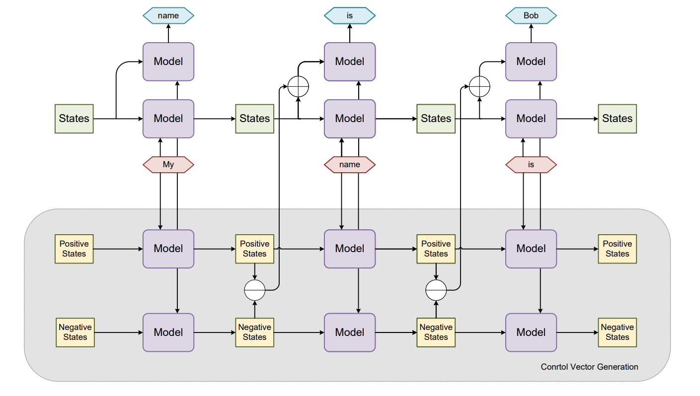

# Directional State Enhancement

## Introduction

When drafting prompts for large language models, it is challenging to ascertain whether a prompt can fully tap into the model's potential. This raises a deeper question: Can the model's full capabilities be truly invoked through prompts alone?

To address this, we propose the concept of Directional State Enhancement (DSE). This technique focuses on utilizing specific directional vectors in contemporary large Recurrent Neural Networks (RNNs) to further unlock the models' potential. By adjusting states using vectors generated from semantically diverse prompts, we have observed notable advancements in areas such as model output truthfulness, harmful content control, and style control.

